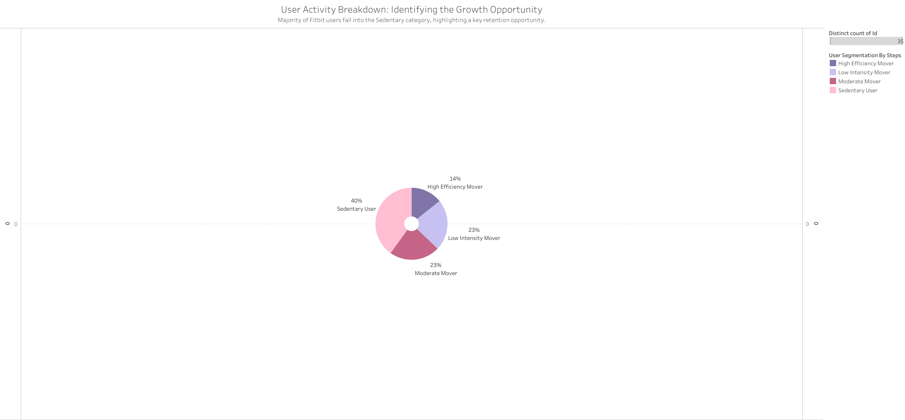
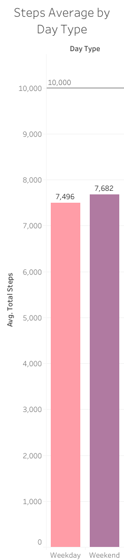

# Product Usage Analysis for Health Tracking Devices

## 1. Ask:
<b>Business Task:</b> Analyze smart device usage data from non-Bellabeat users to identify trends that can inform Bellabeat’s marketing strategy and help them become a larger player in the global smart device market.

 - What are some trends in smart device usage? 
 - How could these trends apply to Bellabeat customers? 
 - How could these trends help influence Bellabeat marketing strategy?

## 2. Prepare:

<b>Data Source:</b> Fitbit Fitness Tracker Data (Public domain via Kaggle)

<b>Content</b>: Personal tracker data from over thirty Fitbit users, including daily activity, steps and sleep.

<b>Limitations & Bias: </b>  

 - <b>Sample Size:</b> The dataset only includes over 30 users, which might be considered a limited representation.
 - <b>Duration:</b> 31-62 days of data, does not account for seasonality.
 - <b>Date:</b> Data is from 2016, user habits and sensor accuracy may have changed.
 - <b>Missing Demographics:</b> Age, gender and location are not included. Since Bellabeat focuses on women's health, analyzing a gender-neutral or unknown dataset presents a limitation.

## 3. Process:

<b> Tooling: </b> 

 - Tableau (Data Visualization)
 - Google Sheets (Data Cleaning & ETL)
 - Excel (Data Cleaning & ETL)
 - SQL (Data Cleaning & ETL)
 
<b> Cleaning & Transformation Steps: </b>

 - <b>Data Integrity & Consistency:</b> Verified data integrity and removed irrelevant columns.
 - <b>Normalization & Best Practices:</b> Renamed column headers following standard naming conventions. (CamelCase/snake_case) to improve readability and ensure smoother integration during the analysis.
 - <b>ISO Date & Locale Fix:</b> Changed data format to ISO 8601 and sorted locale issues.
 - <b>Master Table Creation:</b> Consolidated multiple CSV files into a centralized Master Table, enabling efficient joins and agile updates during the visualization phase.
 
<b> Added Features: </b>
 - <b>Day Type:</b> Created a dimension to segment activity between Weekdays and Weekends. 
 - <b>User Segmentation:</b> Implemented logic to classify users based on their activity volume.
 - <b>Movement Quality:</b> Developed a calculated column to score movement intensity, identifying "High Efficiency" periods beyond simple step counts.
 - <b>Goal Achievement:</b> Built conditional logic to track compliance with the 10K step health benchmark.

## 4. Analyze & Share:

<b>A. Temporal Engagement Patterns </b>

<b>Finding:</b> There is a clear upward trajectory in user activity peaking during Week 14, followed by a sharp decline in Week 15. This suggests that Week 14 represents a strategic window for high-budget marketing campaigns and product releases to capitalize on peak organic motivation.

<b>B. User Segmentation, Sedentary percentage by day & Sleep Gap: </b>

<b>Finding:</b> Users were categorized into four distinct segments based on daily steps intensity. The "Sedentary User" group represents the largest segment at 40%. This highlights a significant growth opportunity for Bellabeat: by converting this sedentary majority, they can achieve a higher overall engagement impact. While High Efficiency Movers are more active, they still spend 62% of their day sedentary. This highlights a universal opportunity for Bellabeat to encourage 'micro-movements' across all user tiers to break long periods of inactivity.

<b>The Sleep Gap</b>: Approximately 31% of users do not wear their device during the night, resulting in a critical loss of health data that could provide more holistic wellness insights.

<b>C. The 10K Step Threshold Paradox:</b>

While 10,000 steps is widely accepted as the standard health goal, research indicates that 8,000 steps are sufficient to achieve major health benefits (Source: UCLA Health, NIH, BBC and OMS). However, the 10K mark remains a powerful marketing legacy from the 1960s. For this analysis, I maintained the 10K threshold to align with industry marketing standards while using the 8K benchmark for medical context.

 - <b>Weekly Activity Trends:</b> Initial analysis shows that activity levels remain relatively close between weekdays and weekends, though there is a noticeable "Weekend Warrior" surge in specific segments.
 - <b>The Average Trap:</b> While it might seem that users struggle to meet their goals, "High Efficiency" and "Moderate" movers frequently exceed the 10K threshold. The overall average is primarily pulled down by the "Sedentary User" majority.

<b>Finding:</b> The data indicates that the primary barrier is not lack of exercise intensity, but rather excessive sedentary time. There is a clear "friction barrier" that keeps Sedentary Users from transitioning to higher activity levels. To validate the 10K goal beyond marketing, I analyzed the correlation between user segments and energy expenditure. The data reveals a clear "Caloric Reward": High Efficiency Movers burn, on average, 1,000 more calories per day than Sedentary Users, this represents a powerful value proposition for the Bellabeat app. Instead of just tracking steps, the interface should visualize this "Metabolic Bonus", showing users the direct impact of reaching their step goals on their daily caloric burn.

## 5. Act (Final Recommendations):

Based on the analysis, I propose the following strategic actions for Bellabeat to increase market share and user retention:

**I. Marketing Strategy & Timing**

-   **Maximize Motivation Peaks:** Concentrate marketing spend and major launches during Weeks 13 and 14 to align with organic user peaks.
    
-   **Retention Safeguards:** Implement "Re-engagement Campaigns" starting in Week 15 to counteract the observed post-peak activity drop.
    

**II. Personalized Engagement by Segment**

-   **The Sedentary Majority (Growth Opportunity):** Pivot focus toward this group by promoting "Low-Barrier entry" strategies, such as "10-minute micro-movements" or "Active Desk" reminders to reduce friction and build consistent usage habits.
    
-   **Moderate & Low Intensity Movers:** Implement gamification through "Tier Up" challenges to nudge users toward the next activity level.
    
-   **High Efficiency Movers (Brand Ambassadors):** Incentivize these users with premium features or early access to device upgrades, leveraging their success stories to build community leaderboards.
    

**III. Product & Feature Enhancements**

-   **Close the Sleep Gap:** Introduce "Nightly Reminders" and personalized insights linking yesterday’s activity to last night’s sleep quality, demonstrating the 24/7 value of the device.
    
-   **Psychological Win Goal:** Introduce an intermediate 8K step goal. Use push notifications when a user is within 1K steps of their target to provide an achievable win and prevent churn caused by unrealistic targets.
    
-   **Streak Rewards:** Implement a "Streak" feature to reward consistency, focusing on long-term habit formation over high-intensity peaks.
