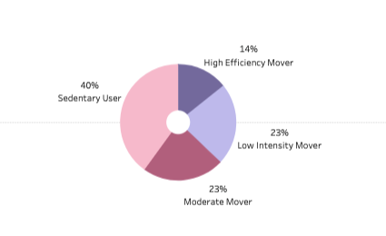
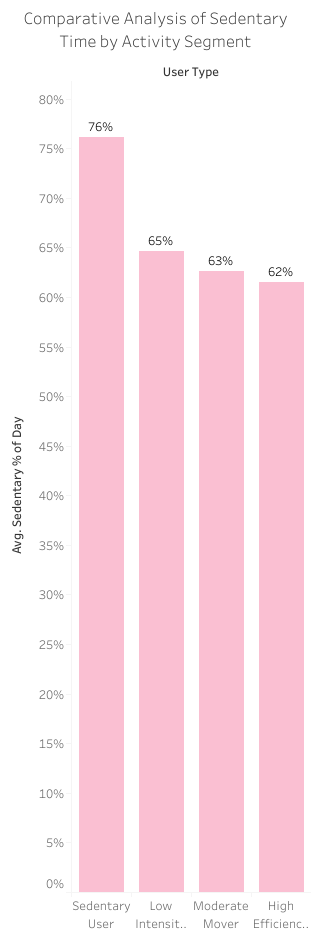
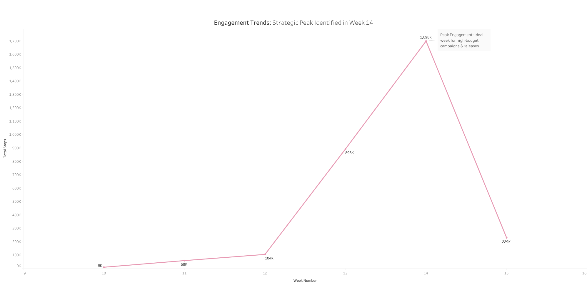

### Executive Summary:

User retention and device engagement are critical for Bellabeat’s growth in the smart device market. Using **SQL, Tableau, and Excel**, I analyzed Fitbit user data to identify where engagement drops occur. I discovered that **40% of users are categorized as sedentary** and **31% fail to wear the device at night (Sleep Gap)**. I recommend implementing "Micro-movement" triggers and a "Metabolic Bonus" visualization, which could significantly increase daily active engagement and data retention.

### Business Problem:

Bellabeat needs to understand how non-users interact with smart devices to refine its marketing and product features. The primary challenge is identifying the "friction points" that lead to high sedentary time and inconsistent device usage (specifically during sleep). How can we move the "Sedentary Majority" toward more active segments and ensure 24/7 device wearability?

### Methodology:

-   **SQL:** Cleaned and merged daily activity and sleep datasets using CTEs and Left Joins to identify the "Sleep Gap."
    
-   **Tableau:** Developed a comprehensive dashboard to segment users and visualize sedentary vs. active ratios.
    
-   **Excel/Sheets:** Performed ETL and created a caloric burn prediction model to quantify the "Metabolic Bonus" of reaching step goals.
    

### Skills:

-   **SQL:** Joins, Data Cleaning, Aggregate Functions, Rounding/Calculated Fields.
    
-   **Tableau:** User Segmentation, Funnel Visualization, Trend Analysis, Dashboard Design.
    
-   **Google Apps Script / Excel:** ETL and statistical correlation.
    

### Results & Business Recommendation:

By democratizing this data through a self-serve dashboard, stakeholders can now visualize the funnel from "Inactive" to "High Efficiency" mover. The analysis revealed that even the most active users spend **62% of their day sedentary**, and 31% of health data is lost nightly due to the "Sleep Gap."

According to my analysis, converting a "Sedentary User" to a "Moderate Mover" represents a **1,000+ calorie daily burn difference**. To capture this "Metabolic Bonus," I recommend:

-   **Feature Update (The Win Goal):** Introduce an 8K step "Intermediate Goal" to reduce user churn caused by the daunting 10K threshold.
    
-   **Smart Notifications:** Send "Nightly Reminders" and link previous day's activity to sleep quality to close the 31% data gap.
    
-   **Visual Value Prop:** Update the app UI to visualize caloric expenditure in real-time, showing users the direct "Caloric Reward" of moving from one segment to another.
    

These adjustments tackle the largest fallout points in the daily usage funnel, increasing both user health outcomes and long-term device retention.

### Next Steps:

-   **A/B Test:** Test push notification copy for "Micro-movements" vs. "Step Goals."
    
-   **Correlation Study:** Analyze if closing the "Sleep Gap" leads to higher daytime activity.
    
-   **Campaign Launch:** Align high-budget marketing with the organic motivation peak identified in Week 14.

